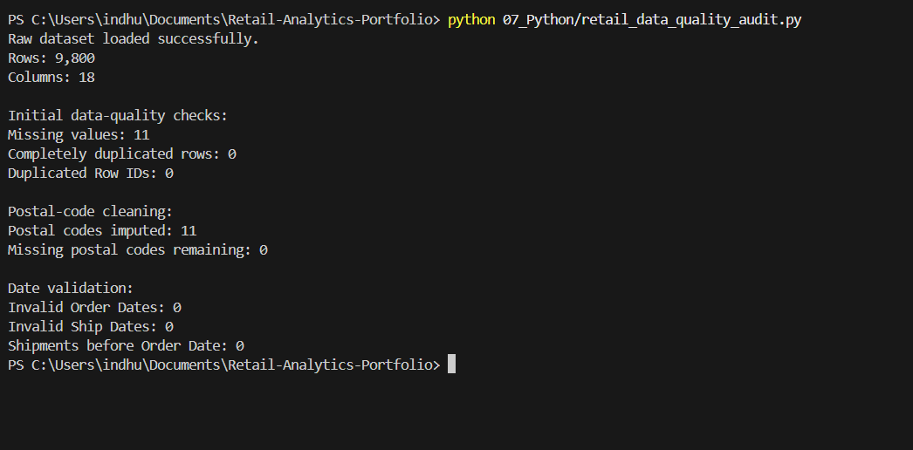
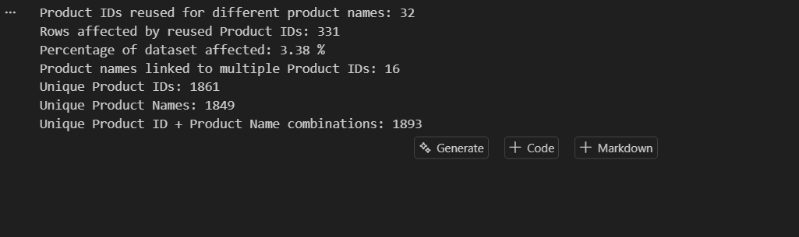
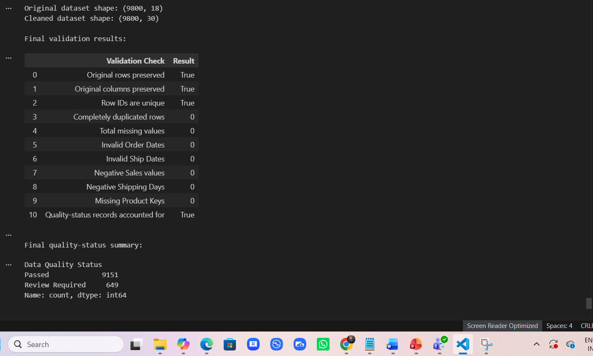
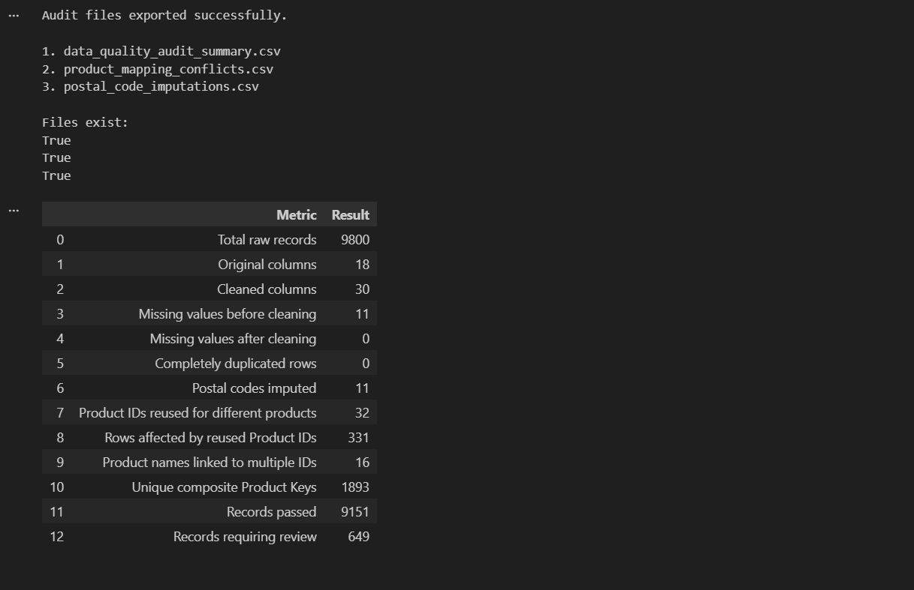
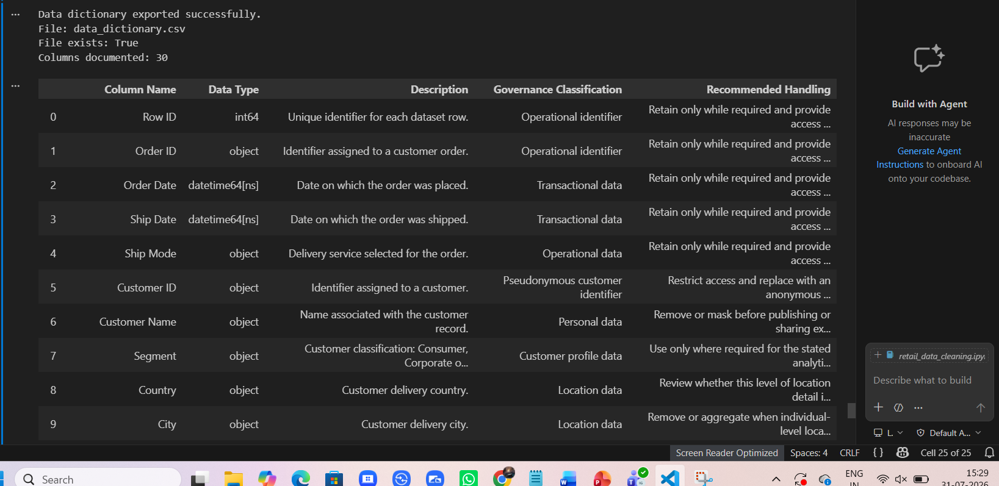
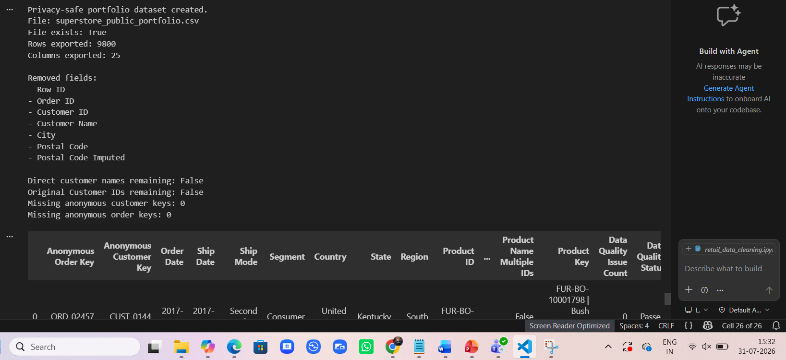
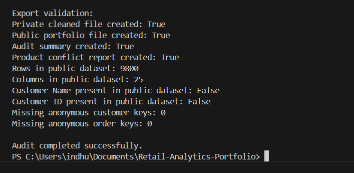

# Retail Data Quality and Information Governance Audit

## Project Overview

This project demonstrates how Python can be used to assess, clean, validate and document the quality of a retail transaction dataset while applying practical information-governance principles.

The analysis covers **9,800 retail transaction records** and focuses on:

- Data-quality validation
- Missing-value investigation
- Master-data consistency
- Transparent data correction
- Privacy and data minimisation
- Pseudonymisation
- Audit documentation
- Preparation of an analysis-ready dataset

The project preserves the original source data and records important cleaning decisions through audit flags and supporting documentation.

---

## Business Problem

Poor-quality customer, product and transaction data can lead to:

- Inaccurate business reporting
- Incorrect customer or product analysis
- Unreliable analytical outputs
- Duplicate or conflicting master records
- Privacy and information-governance risks

The objective of this project was to create a controlled and reproducible process that identifies these risks without silently deleting or overwriting valid source records.

---

## Dataset

The original retail dataset contains:

- **9,800** transaction-line records
- **18** original columns
- **4,922** orders
- **793** customers
- Sales records from **2015 to 2018**

The dataset contains order, customer, location, product, shipping and sales information.

The original raw dataset and private cleaned dataset are intentionally excluded from the public GitHub repository.

---

## Data-Quality Checks Completed

The following checks were performed:

- Row and column validation
- Missing-value analysis
- Complete duplicate detection
- Duplicate Row ID detection
- Date-format validation
- Shipping-date validation
- Sales-value validation
- Blank-text and extra-space checks
- Customer ID and Customer Name consistency
- Order ID and Customer ID consistency
- Product ID and Product Name consistency
- Product master-data validation
- Privacy and direct-identifier review

---

## Key Findings

| Finding | Result |
|---|---:|
| Total records reviewed | 9,800 |
| Original columns | 18 |
| Missing values identified | 11 |
| Completely duplicated rows | 0 |
| Duplicate Row IDs | 0 |
| Invalid Order Dates | 0 |
| Invalid Ship Dates | 0 |
| Shipments before Order Date | 0 |
| Negative Sales values | 0 |
| Product IDs reused for different products | 32 |
| Rows affected by reused Product IDs | 331 |
| Product names linked to multiple Product IDs | 16 |
| Unique composite Product Keys created | 1,893 |
| Records passing all checks | 9,151 |
| Records requiring review | 649 |

---

## Visual Evidence

### 1. Initial Data-Quality Audit

The automated audit reviewed **9,800 records across 18 source columns**, identified **11 missing values**, and confirmed that there were no complete duplicate rows or duplicate Row IDs.



---

### 2. Product Master-Data Findings

The audit identified significant master-data inconsistencies.

- **32 Product IDs** were associated with different products
- **331 records** were affected by reused Product IDs
- **16 Product Names** were linked to multiple Product IDs
- **1,893 unique composite Product Keys** were created



---

### 3. Final Validation Summary

Final validation confirmed that:

- All **9,800 source records** were preserved
- The cleaned dataset contained **30 columns**
- No missing values remained
- No duplicate Row IDs remained
- No invalid order or shipping dates remained
- All Product Keys were complete
- **9,151 records passed**
- **649 records required review**



---

### 4. Audit Documentation Outputs

Structured audit files were generated to document the cleaning process, master-data conflicts and final data-quality results.



---

### 5. Information-Governance Data Dictionary

A data dictionary was created for the cleaned dataset.

It documents:

- Column names
- Data types
- Field descriptions
- Governance classifications
- Recommended handling



---

### 6. Privacy-Safe Portfolio Dataset

A separate public portfolio dataset was created using data-minimisation and pseudonymisation principles.

Direct identifiers and precise location fields were removed, while customer and order identifiers were replaced with anonymous keys.



---

### 7. Final Export Validation

The final automated validation confirmed that:

- The private cleaned dataset was created
- The public portfolio dataset was created
- The audit summary was created
- The product-conflict report was created
- The public dataset retained all 9,800 rows
- Customer Name was not present in the public dataset
- Original Customer ID was not present in the public dataset
- Anonymous customer keys were complete
- Anonymous order keys were complete



---

## Missing Postal-Code Treatment

Eleven postal-code values were missing from the original dataset.

All affected records related to **Burlington, Vermont**. The missing values were filled using the documented Burlington postal code:

`05401`

The correction was not applied silently.

A Boolean audit field named:

`Postal Code Imputed`

was created so that every modified record remains identifiable.

Postal codes were also converted to text values to preserve leading zeros.

---

## Product Master-Data Issue

The audit identified **32 Product IDs** associated with more than one Product Name.

The affected records represented genuinely different products rather than simple spelling variations.

For this reason, the original product values were **not overwritten or deleted**.

Instead, the following controls were introduced:

- `Product ID Reused`
- `Product Name Multiple IDs`
- `Product Key`

The `Product Key` combines the original Product ID and Product Name, producing **1,893 unique product combinations** for more reliable analysis.

This approach preserves the source data while clearly identifying records affected by master-data conflicts.

---

## Data-Quality Status

Each transaction received an overall data-quality result.

The following fields were created:

- `Data Quality Issue Count`
- `Data Quality Status`
- `Data Quality Notes`

Records without a known issue were classified as:

`Passed`

Records containing one or more identified issues were classified as:

`Review Required`

This approach retains potentially valuable transactional records while clearly communicating their known limitations.

Final results:

- **9,151 records — Passed**
- **649 records — Review Required**

---

## Information-Governance Controls

The project applies several practical information-governance principles.

### Data Minimisation

The public dataset excludes:

- Customer Name
- Original Customer ID
- Original Order ID
- Exact City
- Postal Code
- Internal Row ID

### Pseudonymisation

Original customer and order identifiers were replaced with:

- `Anonymous Customer Key`
- `Anonymous Order Key`

### Auditability

Important cleaning and validation decisions are recorded using:

- Audit flags
- Quality-status fields
- Quality notes
- Audit-summary documentation
- Master-data conflict reports

### Access Control

The following files are deliberately excluded from the public GitHub repository through `.gitignore`:

- Raw source dataset
- Private cleaned dataset
- Detailed postal-code imputation evidence
- Record-level working Jupyter notebook

### Purpose Limitation

The public portfolio dataset retains only the information needed to demonstrate analytical, data-quality and governance techniques.

---

## Analysis-Ready Fields Added

The following calculated and governance fields were added:

- `Shipping Days`
- `Order Year`
- `Order Month Number`
- `Order Month`
- `Order Year-Month`
- `Postal Code Imputed`
- `Product ID Reused`
- `Product Name Multiple IDs`
- `Product Key`
- `Data Quality Issue Count`
- `Data Quality Status`
- `Data Quality Notes`

These fields improve auditability and make the cleaned dataset suitable for downstream analytical work.

---

## Repository Structure

```text
Retail-Analytics-Portfolio/
│
├── 01_Raw_Data/
│   └── Private raw dataset — excluded from GitHub
│
├── 02_Cleaned_Data/
│   ├── superstore_cleaned.csv — private and excluded
│   └── superstore_public_portfolio.csv
│
├── 05_Documentation/
│   ├── data_dictionary.csv
│   ├── data_quality_audit_summary.csv
│   ├── product_mapping_conflicts.csv
│   └── postal_code_imputations.csv — private and excluded
│
├── 06_Images/
│   ├── 01_initial_audit_summary.png
│   ├── 02_product_master_data_findings.png
│   ├── 03_final_validation_summary.png
│   ├── 04_audit_documentation_outputs.png
│   ├── 05_data_dictionary_governance.png
│   ├── 06_privacy_safe_dataset.png
│   └── 07_final_export_validation.png
│
├── 07_Python/
│   ├── retail_data_cleaning.ipynb — private and excluded
│   └── retail_data_quality_audit.py
│
├── .gitignore
├── requirements.txt
└── README.md
```

---

## Public Repository Files

### `retail_data_quality_audit.py`

A reproducible Python script containing the main validation, cleaning, master-data auditing, quality-status creation and privacy-safe export process.

### `superstore_public_portfolio.csv`

A privacy-safe version of the cleaned dataset with direct customer identifiers and precise location fields removed.

### `data_quality_audit_summary.csv`

A structured summary of the principal audit findings and cleaning results.

### `product_mapping_conflicts.csv`

Detailed evidence of Product IDs associated with multiple Product Names.

### `data_dictionary.csv`

Documentation describing the purpose, data type, governance classification and recommended handling of the cleaned-data fields.

### `06_Images/`

Privacy-safe visual evidence showing:

- Initial data-quality checks
- Master-data findings
- Final validation results
- Audit documentation
- Information-governance controls
- Public-data preparation
- Final export validation

---

## Tools and Technologies

- Python
- pandas
- pathlib
- Jupyter Notebook
- Visual Studio Code
- CSV
- Git
- GitHub

---

## Running the Python Audit

### 1. Clone the repository

```bash
git clone https://github.com/indhu020297/Retail-Analytics-Portfolio.git
```

### 2. Move into the project directory

```bash
cd Retail-Analytics-Portfolio
```

### 3. Install the required Python dependency

```bash
pip install -r requirements.txt
```

### 4. Add the raw dataset locally

The public Python script expects the original dataset to be available at:

```text
01_Raw_Data/superstore_raw.csv
```

The raw dataset is not included in this public repository.

### 5. Run the audit

```bash
python 07_Python/retail_data_quality_audit.py
```

The script produces:

- Private cleaned dataset
- Privacy-safe public dataset
- Data-quality audit summary
- Product master-data conflict report

---

## Privacy-Safe Repository Design

The public repository was deliberately designed so that sensitive or unnecessary record-level information is not exposed.

The public dataset does not contain:

- Customer Name
- Original Customer ID
- Original Order ID
- Exact City
- Postal Code
- Internal Row ID

Instead, anonymised customer and order keys are used where identifiers are required for analytical purposes.

This separation allows the project to demonstrate reproducible data-quality work while maintaining a clear distinction between private working data and public portfolio outputs.

---

## Limitations

- The dataset does not contain complete street-address information.
- The postal-code correction is recorded as an imputation rather than treated as verified address-level information.
- Conflicting product identifiers cannot be conclusively corrected without an authoritative product master-data source.
- Records requiring review are retained because their transactional values may still be useful.
- The dataset is used as a portfolio simulation and does not represent a live organisational information-governance system.

---

## Recommendations

1. Introduce validation rules when Product IDs are created.
2. Maintain one authoritative product master-data table.
3. Prevent Product IDs from being assigned to multiple products.
4. Require mandatory postal-code validation during data entry.
5. Maintain an audit trail for corrected or imputed values.
6. Restrict access to direct customer identifiers.
7. Use anonymised or aggregated data for public reporting.
8. Review records marked as `Review Required` before operational use.

---

## Skills Demonstrated

### Python and Data Processing

- Python data cleaning
- pandas
- Data transformation
- Date standardisation
- Data validation
- Reproducible scripting

### Data Quality

- Missing-value investigation
- Duplicate detection
- Validation-rule design
- Master-data consistency analysis
- Data-quality flagging
- Data-quality status classification

### Information Governance

- Data minimisation
- Pseudonymisation
- Privacy-aware data preparation
- Audit-trail creation
- Controlled public/private data separation
- Data classification
- Data documentation

### Analytical and Professional Skills

- Investigative analysis
- Problem solving
- Documentation
- Data-quality reporting
- Master-data issue identification
- Reproducible project organisation
- Git and GitHub version control

---

## Project Outcome

The project transformed a raw **9,800-row retail dataset** into a validated, documented and governance-aware analytical dataset while preserving the original records.

Rather than silently deleting problematic data, the project identifies and documents quality concerns using transparent audit flags and quality-status fields.

The final solution provides:

- A reproducible Python audit process
- A private cleaned dataset
- A privacy-safe public portfolio dataset
- Structured audit documentation
- Master-data conflict evidence
- A governance-focused data dictionary
- Visual evidence of the validation and privacy process

This project demonstrates an end-to-end approach to **data quality, information governance and privacy-aware data preparation using Python**.